# 📊 Mining Value Chain Optimization - Visual Workflow

## 🏗 Overall System Architecture

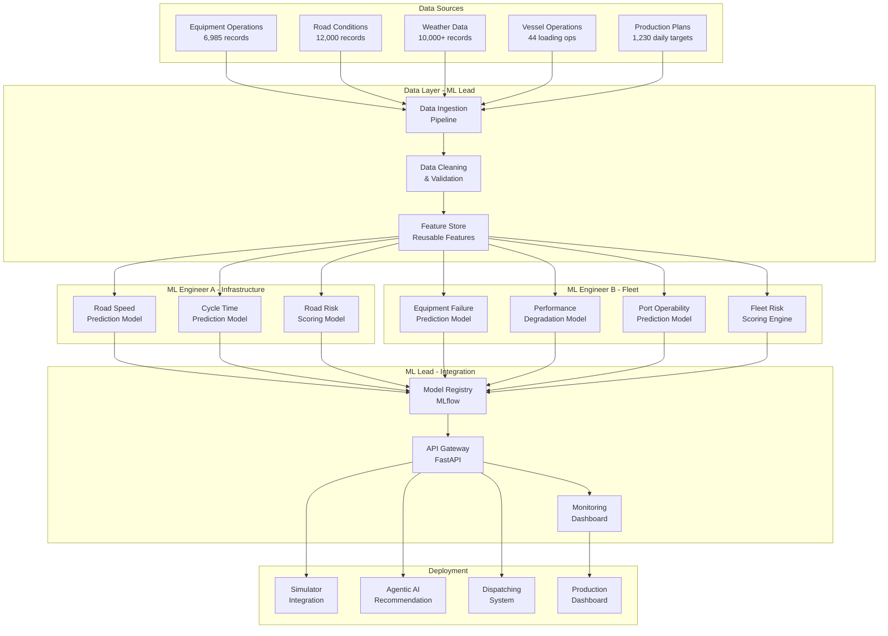

---

## 📅 8-Week Project Timeline

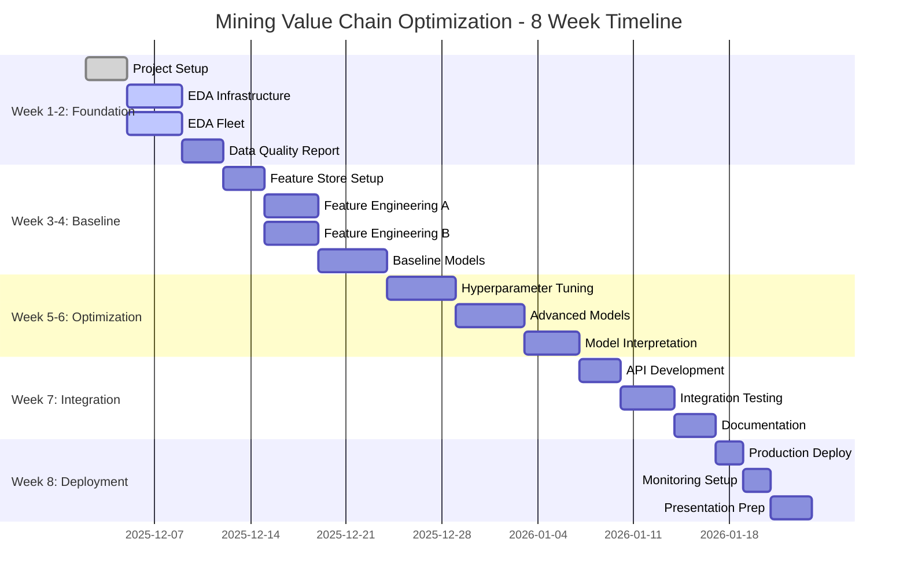

---

## 🔄 ML Pipeline Flow - ML Engineer A (Infrastructure)

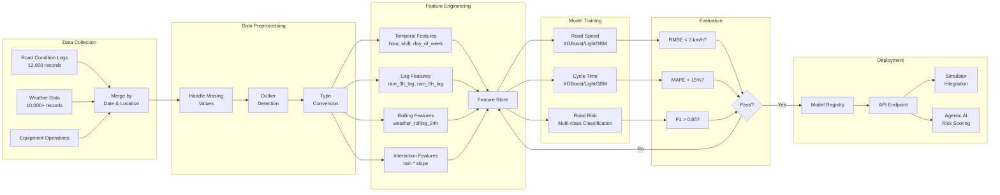

---

## 🔄 ML Pipeline Flow - ML Engineer B (Fleet & Logistics)

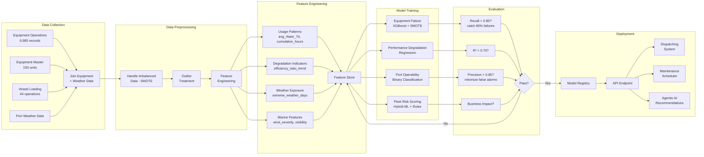

---

## 🤝 Team Collaboration Flow

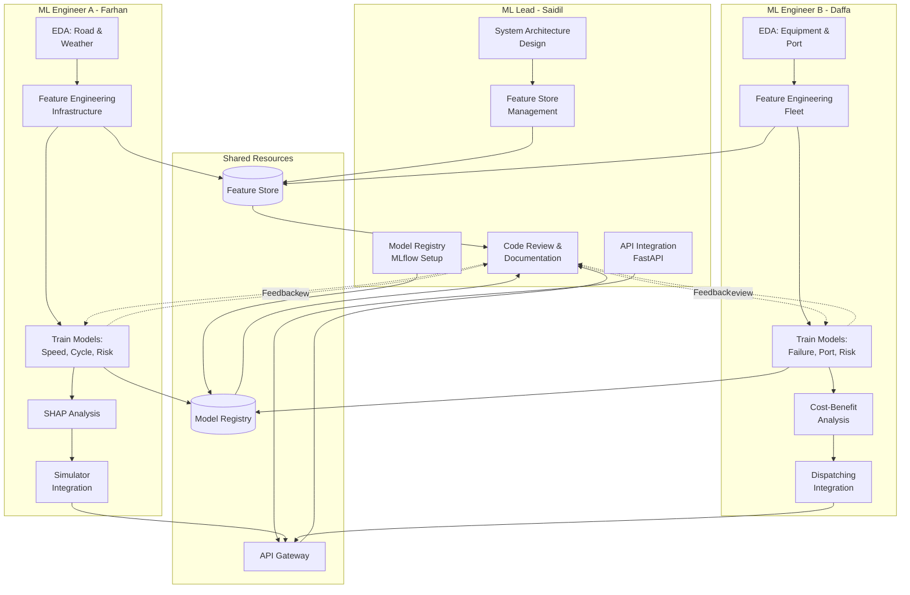

---

## 📊 Model Performance Dashboard Structure

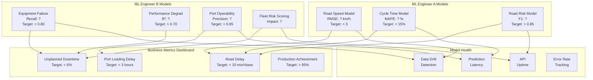

---

## 🔄 Data Flow Architecture

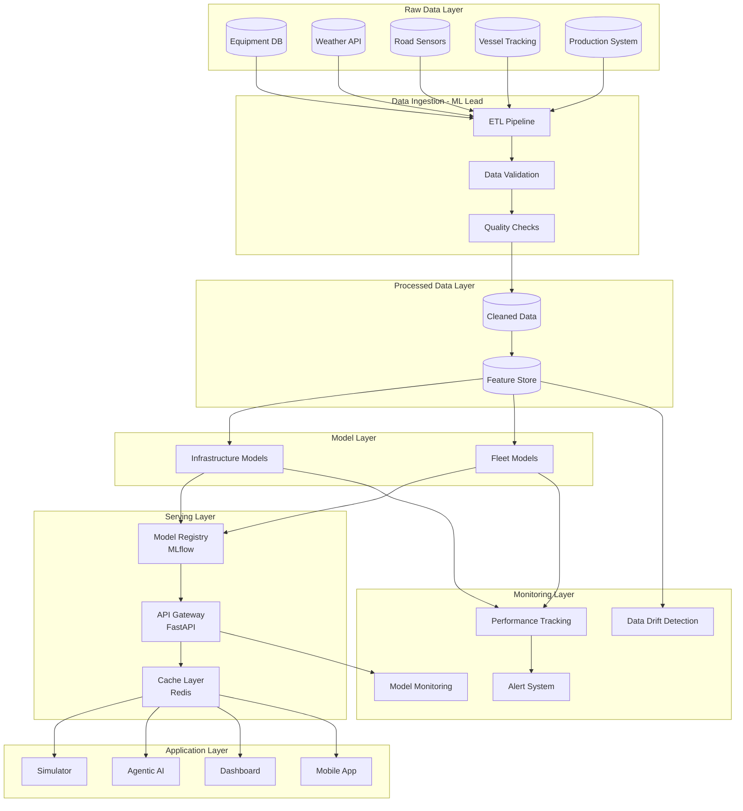

---

## 🎯 Feature Engineering Strategy

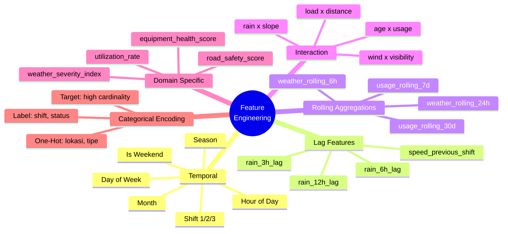

---

## 🚀 Deployment Architecture

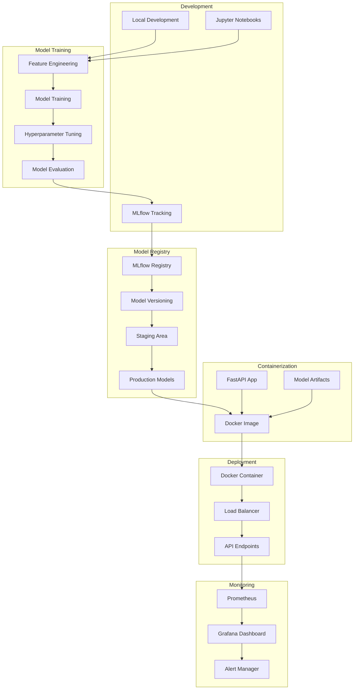

---

## 📈 Model Performance Tracking

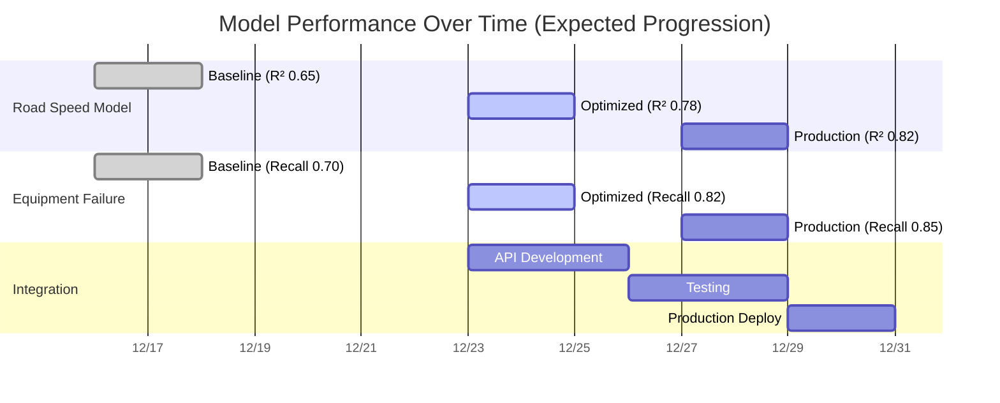

---

## 🎓 Capstone Presentation Flow

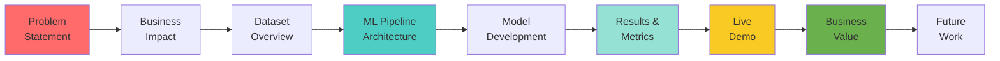

---

**Created by:** ML Lead - Saidil Mifdal  
**Last Updated:** December 2, 2025  
**Tool:** Mermaid Diagrams  
**Status:** ✅ Ready for Team Review
